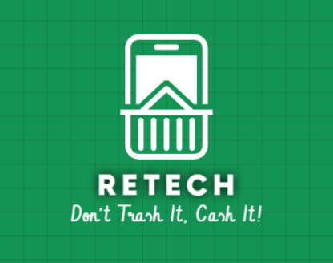

# RETECH - Electronics Recycling Platform ♻️

Sustainable Electronics Recycling & Rewards

---

## 📚 Table of Contents
- [Overview](#-overview)
- [Features](#-features)
- [How It Works](#-how-it-works)
- [Tech Stack](#-tech-stack)
- [Project Structure](#-project-structure)
- [Getting Started](#-getting-started)
- [Usage](#-usage)
- [Contributing](#-contributing)
- [Data Storage](#-data-storage)
- [FAQ](#-faq)
- [Contact](#-contact)

## 📝 Overview

RETECH is a user-friendly web platform that connects consumers with recycling companies to promote sustainable disposal of electronic devices. Users can recycle electronics while earning rewards, companies manage recycling operations, and administrators oversee the entire ecosystem.

**Key Value Proposition:**
- Make electronics recycling easy, rewarding, and transparent for everyone.
- Empower companies and administrators to manage recycling efficiently.

## ✨ Features

### 👤 Customers
- 🔄 Submit electronics (phones, laptops, appliances) for recycling
- 🎁 Earn points redeemable for vouchers
- 📊 Track recycling request status in real-time
- 👤 Manage personal information and recycling history

### 🏭 Recycling Companies
- 📦 Browse and select available devices
- 🛒 Add and manage devices for processing
- 📋 Handle recycling orders with pickup scheduling
- 📈 View statistics and manage operations

### 🔧 Administrators
- 👥 Oversee customer and company accounts
- 🔍 Track recycling activities system-wide
- 📝 Manage site content and recycling options

## 🔄 How It Works

1. **Customers** sign up, submit devices for recycling, and earn rewards.
2. **Recycling Companies** process device requests, manage inventory, and schedule pickups.
3. **Administrators** monitor the platform, manage users, and oversee content.



## 🛠️ Tech Stack

| Technology   | Purpose       |
| ------------ | ------------- |
| HTML5        | Structure     |
| CSS3         | Styling       |
| JavaScript   | Functionality |
| Bootstrap    | UI Components |
| Font Awesome | Icons         |

## 📂 Project Structure

```
RETECH/
│
├── css/                    # Stylesheets
│   ├── main.css            # Core styles
│   ├── responsive.css      # Mobile responsiveness
│   ├── profile.css         # Profile page styles
│   ├── market.css          # Marketplace styles
│   ├── login.css           # Login page styles
│   ├── signup.css          # Signup page styles
│   ├── rewards.css         # Rewards system styles
│   ├── faq.css             # FAQ page styles
│   ├── contact.css         # Contact page styles
│   ├── about-us.css        # About page styles
│   ├── admin.css           # Admin styles
│   ├── admin-dashboard.css # Admin dashboard styles
│   └── admin-filters.css   # Admin filtering components
│
├── js/                     # JavaScript files
│   ├── main.js             # Core application logic
│   ├── auth.js             # Authentication functionality
│   ├── profile.js          # User profile functionality
│   ├── market.js           # Marketplace functionality
│   ├── login.js            # Login page functionality
│   ├── utils.js            # Utility functions
│   ├── data.js             # Data management
│   ├── recycle-forms.js    # Recycling submission forms
│   ├── recycling-cart.js   # Cart functionality
│   ├── recycling-orders.js # Order management
│   ├── recycling-dashboard.js # Dashboard functionality
│   ├── inventory.js        # Inventory management
│   ├── faq.js              # FAQ page interactivity
│   ├── contact.js          # Contact form handling
│   ├── image-upload.js     # Image upload functionality
│   ├── about-us.js         # About page functionality
│   ├── admin.js            # Admin functionality
│   └── admin/              # Admin-specific modules
│
├── html/                   # HTML pages
│   ├── index.html          # Landing page
│   ├── login.html          # Login page
│   ├── signup.html         # Signup page
│   ├── profile.html        # User profile page
│   ├── customer-profile.html # Customer profile variant
│   ├── company-profile.html # Company profile variant
│   ├── market.html         # Marketplace page
│   ├── about-us.html       # About us page
│   ├── contact-us.html     # Contact page
│   ├── faq.html            # FAQ page
│   ├── rewards.html        # Rewards page
│   ├── recycle-phone.html  # Phone recycling page
│   ├── recycle-laptop.html # Laptop recycling page
│   ├── recycle-kitchen.html # Kitchen appliance recycling
│   ├── recycle-electronics.html # Electronics recycling
│   ├── recycling-cart.html # Recycling cart
│   ├── recycling-orders.html # Orders management
│   ├── recycling-dashboard.html # Recycling dashboard
│   ├── inventory-store.html # Inventory management
│   └── admin-dashboard.html # Admin dashboard
│
└── images/                 # Image assets
    ├── market/             # Marketplace images
    ├── recycle-symbol.png  # Logo and branding
    ├── retech1.png         # Brand assets
    ├── retech2.png         # Brand assets
    └── [various product and category images]
```

## 🚀 Getting Started

### Prerequisites
- Modern web browser (Chrome, Firefox, Safari, Edge)

### Installation
1. **Clone the repository:**
   ```bash
   git clone https://github.com/abdelfattahelnaggar/ReTeck-frontend.git
   cd retech-frontend
   ```
2. **Open the project:**
   - Using VS Code with Live Server:
     - Open the folder in VS Code
     - Right-click on `html/index.html` and select "Open with Live Server"
   - Or simply open in browser:
     - On Mac: `open html/index.html`
     - On Windows: `start html/index.html`

**Troubleshooting:**
- If you see blank pages, ensure your browser allows local file access for JavaScript.
- For best experience, use Live Server or a local web server.

## 🧪 Usage

### Demo Accounts

| Role                 | Email                 | Password   |
| -------------------- | --------------------- | ---------- |
| 👤 Customer          | user@example.com      | user123    |
| 🏭 Recycling Company | company@recycling.com | company123 |
| 🔧 Administrator     | admin@retech.com      | admin123   |

### User Workflows

#### 👤 Customer Journey
1. Sign in using customer credentials
2. Browse recycling categories on the home page
3. Submit devices through the recycling form
4. Track orders and redeem rewards in your profile

#### 🏭 Recycling Company Journey
1. Sign in as a recycling company
2. View available devices on the dashboard
3. Process recycling requests and update status
4. Schedule pickups and manage inventory

#### 🔧 Administrator Journey
1. Access the admin dashboard
2. Manage users, content, and platform settings
3. Monitor overall system performance

## 🤝 Contributing

We welcome contributions to improve RETECH!

### Development Guidelines
- Maintain responsive design principles
- Follow semantic HTML practices
- Use descriptive variable and function names
- Document complex functionality

### Code of Conduct
- Be respectful and inclusive
- Report issues and bugs via GitHub Issues
- For major changes, open an issue first to discuss what you would like to change

## 🔒 Data Storage

This demo application uses `localStorage` for data persistence. In a production environment, this would be replaced with proper backend APIs and database storage.

## ❓ FAQ

**Q: Is my data secure?**
- A: This is a demo app using localStorage. No sensitive data is stored or transmitted.

**Q: Can I use this for my own recycling business?**
- A: Yes! Fork the repo and adapt it to your needs. Please credit the original authors.

**Q: How do I reset demo data?**
- A: Clear your browser's localStorage for the site.

## 📞 Contact

For questions or feedback, please open an issue in the repository or contact the project maintainers.

---

Making the world cleaner, one device at a time
